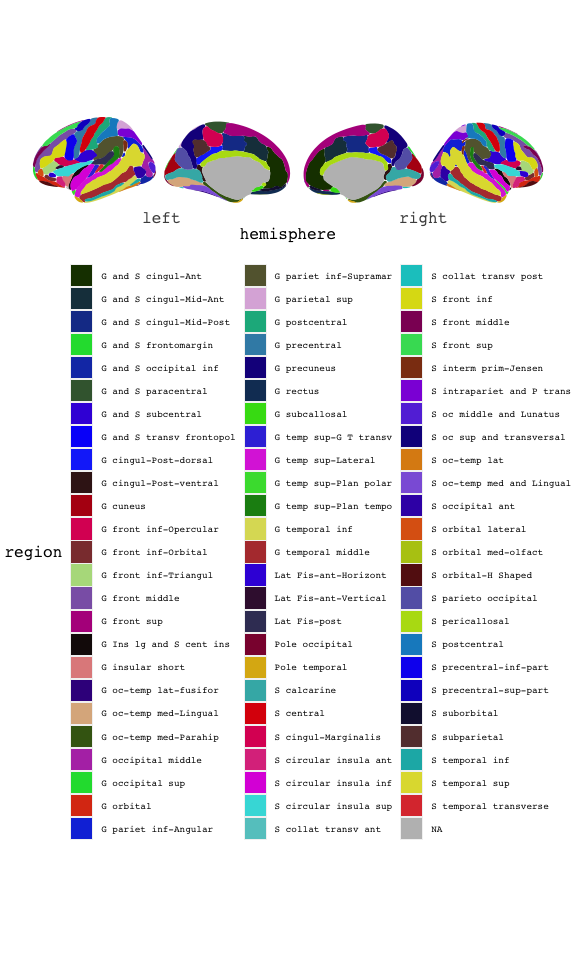
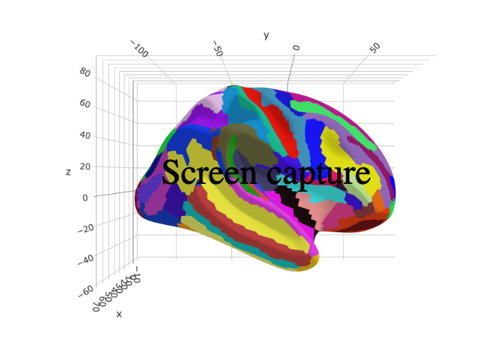

<!-- README.md is generated from README.Rmd. Please edit that file -->

# ggsegDesterieux

<!-- badges: start -->

[](https://travis-ci.com/LCBC-UiO/ggsegDesterieux)
[](https://ci.appveyor.com/project/LCBC-UiO/ggsegDesterieux)
[](https://codecov.io/gh/LCBC-UiO/ggsegDesterieux?branch=master)
[](https://github.com/LCBC-UiO/ggsegDesterieux/actions)
<!-- badges: end -->

This package contains dataset for plotting the Desterieux cortical atlas
ggseg and ggseg3d.

Desterieux, Fischl, Dale,& Halgren (2010) Neuroimage. 53(1): 1–15. doi:
[0.1016/j.neuroimage.2010.06.010](https://www.ncbi.nlm.nih.gov/pmc/articles/PMC2937159/)

## Installation

You can install the released version version from
[GitHub](https://github.com/) with:

``` r
# install.packages("remotes")
remotes::install_github("LCBC-UiO/ggsegDesterieux")
```

## Example

This is a basic example which shows you how to solve a common problem:

``` r
library(ggsegDesterieux)
```

``` r
library(ggseg)
#> Loading required package: ggplot2

plot(desterieux) +
  theme(legend.position = "bottom",
        legend.text = element_text(size = 7)) +
  guides(fill = guide_legend(ncol = 3))
```



``` r
library(ggseg3d)
library(dplyr)

ggseg3d(atlas = desterieux_3d) %>% 
  pan_camera("right lateral")
```



Please note that the ‘ggsegDesterieux’ project is released with a
[Contributor Code of Conduct](CODE_OF_CONDUCT.md). By contributing to
this project, you agree to abide by its terms.
